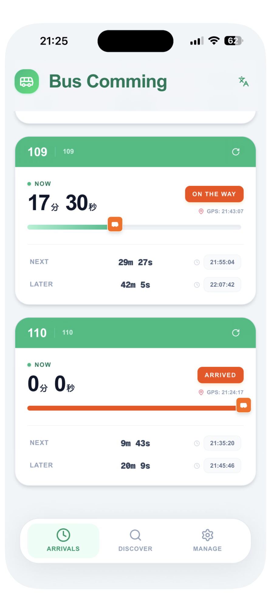
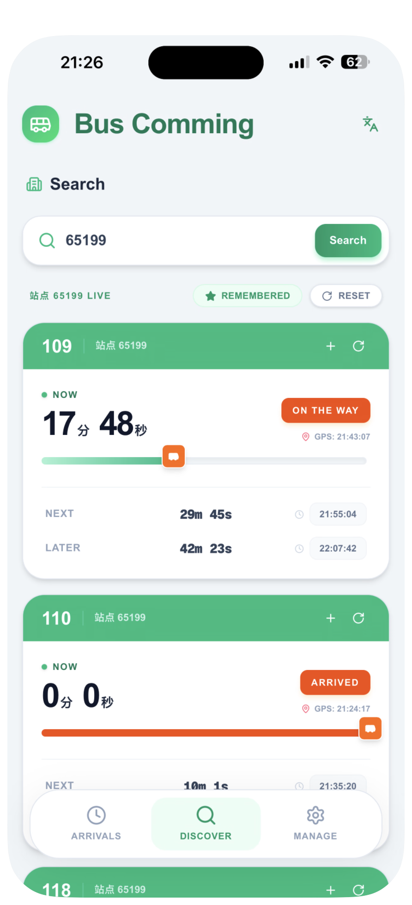
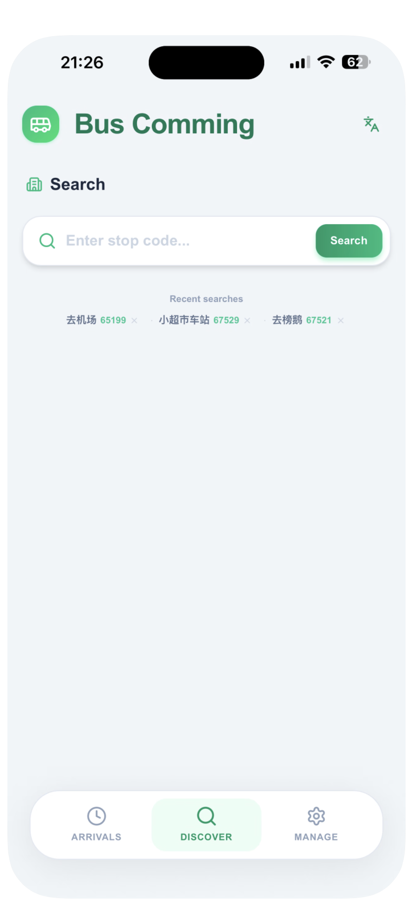
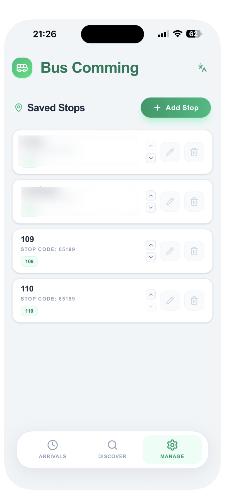

# SG Bus Comming（巴士来了）

面向新加坡公交用户的实时到站查询工具。你可以按站点编号查询公交到站时间，收藏常用站点和关注线路，并将应用安装到手机主屏幕，方便日常通勤使用。

实时公交数据来自 [ArriveLah2](https://arrivelah2.busrouter.sg/)。

## 产品预览

以下截图来自项目中的 `docs/pic/` 目录：

<table>
  <tr>
    <td align="center"></td>
    <td align="center"></td>
    <td align="center"></td>
    <td align="center"></td>
  </tr>
</table>

## 功能特性

- **实时到站查询**：输入公交站码，查看各条线路的下一班、下下班和第三班车预计到站时间。
- **站点收藏**：保存常用站点，并为每个站点配置需要关注的公交线路。
- **站点管理**：新增、编辑、删除站点，支持拖拽调整站点和线路顺序。
- **搜索收藏**：保存常用的站点搜索结果，便于快速再次查询。
- **双语界面**：支持中文和英文，并在浏览器本地保存语言偏好。
- **PWA 安装**：支持将主应用安装到设备主屏幕；Android 使用浏览器原生安装能力，iOS 提供 WebClip 安装描述文件。
- **本地缓存**：站点配置和最近查询结果保存在浏览器本地，重复打开时可先展示缓存数据，再请求最新结果。
- **营销落地页**：提供独立的产品介绍、功能预览、二维码和 Web App 入口。

## 项目结构

```text
sg-bus-comming/
├── frontend/                         # PWA 主应用（Next.js）
│   ├── src/app/page.tsx              # 主页面及主要交互逻辑
│   ├── src/app/api/weather/route.ts  # 公交到站数据代理
│   ├── src/app/api/app/              # PWA 安装相关接口
│   ├── src/app/manifest.ts            # Web App Manifest
│   └── ...
├── web/                              # 产品营销落地页（Vite + React）
│   ├── src/App.tsx
│   ├── src/components/               # 页面与截图预览组件
│   └── ...
├── docs/
│   ├── pic/                          # README 使用的产品截图
│   ├── html/                         # 设计参考代码
│   └── 需求/                         # 需求和实现说明
├── README.md
└── package-lock.json / yarn.lock     # 子项目依赖锁定文件
```

| 目录 | 用途 | 主要技术 |
| --- | --- | --- |
| [`frontend/`](./frontend/) | 可安装的 PWA 主应用、到站查询和 API 代理 | Next.js 16、React 19、TypeScript、Tailwind CSS 4 |
| [`web/`](./web/) | 产品介绍和安装引导落地页 | Vite 8、React 19、TypeScript、Tailwind CSS 4、shadcn/ui |
| [`docs/`](./docs/) | 设计参考、需求文档和产品截图 | Markdown、React 参考代码、PNG |

## 架构概览

```text
┌─────────────────────┐       ┌─────────────────────────┐
│ web/ 营销落地页      │       │ frontend/ PWA 主应用    │
│ Vite + React        │       │ Next.js App Router     │
└──────────┬──────────┘       └────────────┬────────────┘
           │                               │
           │ 打开 Web App                   │ POST /api/weather
           │                               │
           │                    ┌──────────▼──────────┐
           └───────────────────►│ Next.js API Route   │
                                │ Edge Runtime        │
                                └──────────┬──────────┘
                                           │
                                ┌──────────▼──────────┐
                                │ ArriveLah2 API      │
                                │ 新加坡公交到站数据  │
                                └─────────────────────┘
```

### 主应用 `frontend/`

- 页面入口为 [`src/app/page.tsx`](./frontend/src/app/page.tsx)，提供“到站”“发现”“管理”等主要功能区域。
- [`/api/weather`](./frontend/src/app/api/weather/route.ts) 在服务端请求 ArriveLah2，并将上游 `services` 数据转换成前端使用的到站卡片数据。
- 站点、线路、查询结果缓存、语言偏好和安装状态使用浏览器 `localStorage` 保存，不依赖额外数据库。
- [`manifest.ts`](./frontend/src/app/manifest.ts) 定义 PWA 元数据；Android 安装使用 `beforeinstallprompt`，iOS 安装使用 WebClip 描述文件接口。
- 使用 `@opennextjs/cloudflare` 构建并部署到 Cloudflare，运行配置需要 `nodejs_compat`。

### 营销页 `web/`

- 展示产品特性、应用界面预览和二维码。
- “打开 Web App”按钮通过 `VITE_APP_URL` 指向 PWA 主应用。
- 支持中英文切换。
- 截图预览组件位于 [`web/src/components/screenshots/`](./web/src/components/screenshots/)。

## 环境要求

- Node.js 20.x
- npm 10.x（用于 `frontend/`）
- Yarn（用于 `web/`）

建议本地开发和 Cloudflare 构建使用 Node.js 20，以减少运行时版本差异。

## 快速开始

### 1. 启动 PWA 主应用

```bash
cd frontend
npm install
npm run dev
```

打开 <http://localhost:3000>。

常用命令：

```bash
npm run lint       # ESLint 检查
npm run build      # Next.js 生产构建
npm run start      # 启动生产构建
npm run cf:build   # 构建 Cloudflare OpenNext 输出
npm run cf:dev     # 本地预览 Cloudflare Worker
npm run cf:deploy  # 部署到 Cloudflare
```

### 2. 启动营销落地页

```bash
cd web
yarn install
cp .env.example .env   # 可选：配置 PWA 主应用地址
yarn dev
```

打开 <http://localhost:5173>。

常用命令：

```bash
yarn lint
yarn build
yarn preview
```

## 配置环境变量

营销页通过 `VITE_APP_URL` 配置 PWA 主应用地址。复制示例文件：

```bash
cd web
cp .env.example .env
```

| 变量 | 说明 | 默认值 |
| --- | --- | --- |
| `VITE_APP_URL` | “打开 Web App”等按钮的目标地址 | `https://bus.skycore.cloud` |

本地开发时可以在 `web/.env` 中配置：

```dotenv
VITE_APP_URL=http://localhost:3000
```

## API 说明

主应用提供 `/api/weather` 代理接口。浏览器请求主应用接口，由 Next.js 服务端请求 ArriveLah2，避免前端直接依赖上游接口。

### POST（推荐）

```http
POST /api/weather
Content-Type: application/json

{"stationCode":"67661"}
```

### GET（兼容）

```http
GET /api/weather?city=67661
```

`67661` 是示例公交站码。成功响应会返回站点名称和线路数据，例如：

```json
{
  "stationName": "站点 67661",
  "data": [
    {
      "route": "371",
      "nextMinutes": 5,
      "nextSeconds": 12,
      "nextArrival": "10:30:00"
    }
  ]
}
```

接口实现：[`frontend/src/app/api/weather/route.ts`](./frontend/src/app/api/weather/route.ts)。

## 本地数据与隐私说明

项目不使用独立数据库，以下信息仅保存在当前浏览器的 `localStorage` 中：

- 收藏站点及站点排序
- 站点关注线路及线路排序
- 搜索收藏
- 到站数据缓存
- 语言偏好
- PWA 安装状态

清除浏览器站点数据、更换浏览器或更换设备后，本地收藏和缓存不会自动同步。查询公交到站时，站点编号会被发送到项目 API，再由服务端请求 ArriveLah2。

## Cloudflare 部署

`frontend/` 使用 OpenNext 生成 Cloudflare Worker 输出：

```bash
cd frontend
npm install
npm run cf:build
npm run cf:deploy
```

本地模拟 Cloudflare 运行环境：

```bash
npm run cf:dev
```

Cloudflare 项目建议使用以下配置：

| 配置项 | 值 |
| --- | --- |
| Root directory | `frontend` |
| Build command | `npm run cf:build` |
| Deploy command（Workers Builds） | `npx wrangler deploy` |
| `NODE_VERSION` | `20` |
| Compatibility flag | `nodejs_compat` |

相关配置文件：

- [`frontend/wrangler.jsonc`](./frontend/wrangler.jsonc)
- [`frontend/open-next.config.ts`](./frontend/open-next.config.ts)
- [`frontend/next.config.ts`](./frontend/next.config.ts)

请使用 `@opennextjs/cloudflare`，不要将已废弃的 `@cloudflare/next-on-pages` 作为构建适配器。

## 相关文档

- [PWA 主应用开发与 API 说明](./frontend/README.md)
- [营销落地页说明](./web/README.md)
- [PWA 安装方案（Android + iOS）](./docs/需求/PWA安装按钮实现总结（Android+iOS）.md)
- [设计参考代码](./docs/html/)

## 数据来源

公交到站数据由 [ArriveLah2](https://arrivelah2.busrouter.sg/) 提供。使用或公开部署本项目时，请同时遵守上游数据服务的使用条款和接口限制。
